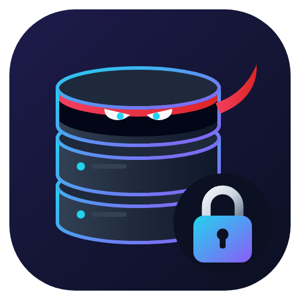

<p align="center"></p>

# NinjaVault

Public .NET packages for integrating with the **NinjaVault CDN Server**.

| Package | NuGet | What it does |
|---|---|---|
| [`NinjaVault.Cdn`](src/NinjaVault.Cdn/README.md) | [](https://www.nuget.org/packages/NinjaVault.Cdn) | Typed CDN client: upload, list, metadata, download, delete, public and presigned URLs. |
| [`NinjaVault.Http`](src/NinjaVault.Http/README.md) | [](https://www.nuget.org/packages/NinjaVault.Http) | **Optional.** Request/response logging, log sinks and `X-Correlation-Id` for any `HttpClient`, including the CDN client. |

Both target `net8.0`, `net9.0` and `net10.0`.

## Quick start

```bash
dotnet add package NinjaVault.Cdn
```

```json
{
  "NinjaVault": {
    "Cdn": {
      "BaseUrl": "https://cdn.example.com",
      "ApiKey": ""
    }
  }
}
```

```bash
dotnet user-secrets set "NinjaVault:Cdn:ApiKey" "cdn_xxxxx"   # or env var NinjaVault__Cdn__ApiKey
```

```csharp
builder.Services.AddNinjaVaultCdn(builder.Configuration);

public sealed class DocumentService(INinjaVaultCdnClient cdn)
{
    public Task<CdnUploadResult> UploadAsync(Stream pdf, long tenantId, CancellationToken ct)
        => cdn.UploadAsync(new CdnUploadRequest("documents", tenantId, pdf, "invoice.pdf", "application/pdf"), ct);
}
```

Want request/response logging and a correlation id on CDN calls? Add the optional package:

```bash
dotnet add package NinjaVault.Http
```

```csharp
builder.Services.AddNinjaVaultCdn(builder.Configuration)
    .AddNinjaVaultHttpLogging(NinjaVault.Cdn.DependencyInjection.ServiceName);
```

Or attach your own logging handler; the CDN package adds none by itself.

See the [NinjaVault.Cdn README](src/NinjaVault.Cdn/README.md) for every operation and error code.

## Repository layout

```
src/NinjaVault.Http/        Optional HTTP logging + correlation package
src/NinjaVault.Cdn/         CDN client package (standalone)
tests/                      xUnit v3 tests for each package
changesets/<PackageId>/     One <Version>.md per released version (release notes)
scripts/                    Change-set helpers used by the Makefile
```

## Building

Requires the .NET 10 SDK (builds all three target frameworks).

```bash
make build     # restore + build, warnings are errors
make test      # run all tests
make help      # list every command
```

Without `make`: `dotnet build NinjaVault.slnx` and `dotnet test NinjaVault.slnx`.

## Releasing a new version

1. Bump `<Version>` in `src/<PackageId>/<PackageId>.csproj`.
2. `make changeset PACKAGE=<PackageId> TYPE=Patch` and fill in the generated `changesets/<PackageId>/<Version>.md`.
3. `make pack` locally to check that it builds, tests pass and the change-set exists.
4. Open a pull request. The **CI** workflow builds, tests, checks formatting and change-sets, and packs.
5. Merge to `main`. The **Publish** workflow finds every package whose `<Version>` is not on nuget.org yet,
   pushes it with NuGet Trusted Publishing (no stored API key),
   and creates a `<PackageId>/v<Version>` tag and GitHub release from the change-set.

nuget.org does not allow a version to be re-uploaded. Always bump `<Version>` for a new release.

### CI/CD setup (one time)

| Where | Setting |
|---|---|
| nuget.org > Trusted Publishing | Repository owner `alisaivi786`, repository `NinjaVault`, workflow file `publish.yml`, environment `production` |
| GitHub > Settings > Environments | `production` (created on first run; add required reviewers to approve each release) |
| GitHub > Settings > Secrets > Actions | `NUGET_USER` = your nuget.org **username** (profile name, not email) |

Manual fallback: `make pack`, then upload `artifacts/packages/*.nupkg` at
<https://www.nuget.org/packages/manage/upload>, or `NUGET_API_KEY=... make push`.

## License

[MIT](LICENSE)
